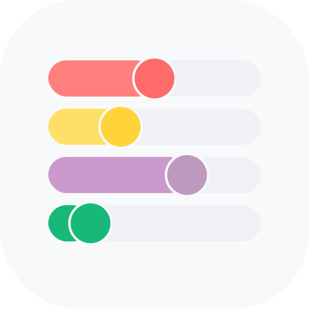
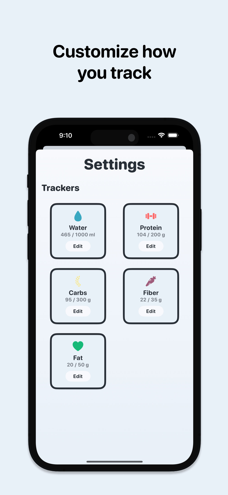
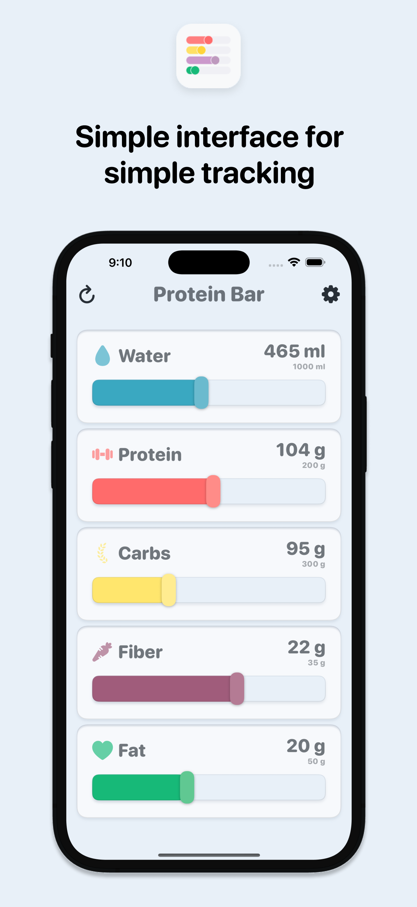

  

  

# Protein Bar: Track What Matters

**Track What Matters, Nothing More**

Protein Bar strips away the complexity of nutrition tracking to focus on what's important. With a beautiful, minimalist interface, you can track your daily nutrition with simple sliders; no complicated calorie counting or endless food logging required.

## Key Features:

• **Intuitive Slider Controls** - Easily adjust your daily intake with a simple swipe

• **Visual Progress** - Color-coded bars show your progress at a glance

• **Focus on Macros** - Track protein, carbs, fiber, fat, and water - the essentials for balanced nutrition

• **Zero Clutter** - No advertisements, social features, or unnecessary complexity

• **Privacy First** - All your data stays on your device

Whether you're building muscle, managing your diet, or just trying to stay hydrated, Protein Bar gives you the tools you need without the overwhelming features you don't.

  
  

